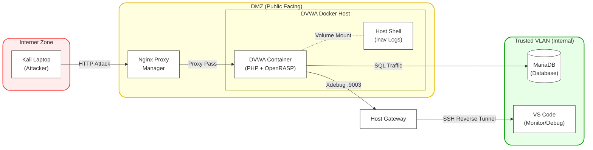

# Automated "Grey Box" DevSecOps Laboratory

  

## 1. Executive Summary

This is an ongoing research project focused on architecting a **Secure SDLC** for the "Damn Vulnerable Web App" (DVWA). Rather than just exploiting vulnerabilities, I am building the ecosystem required to manage them. I established a CI/CD pipeline in GitLab to enforce automated security gates, utilizing **Semgrep**, **Trivy**, and **SonarQube** for static analysis, and **OWASP ZAP** for dynamic validation.

Simultaneously, I am constructing a layered defense architecture to move from a flat network to a segmented, monitored environment. This includes **database isolation**, an **Nginx Proxy Manager** for future WAF implementation, and network monitoring with **Suricata**. To facilitate deep-dive research, I have instrumented the application runtime with **OpenRASP** (in monitoring mode) and **Xdebug**. This setup enables **"Grey Box" analysis**, allowing me to correlate external HTTP attacks directly with internal PHP code execution before actively tuning the defenses.

**Objective:** To simulate the hardening of a legacy application by orchestrating four core domains: Security Engineering, DevSecOps, Vulnerability Management, and AppSec Research. I am utilizing this lab to:
* Map technical exploits to **NIST SP 800-53** control failures.
* Harden the container runtime according to **CIS Docker Benchmarks**.
* Measure the application's posture against the **OWASP ASVS (Level 2)** verification standard.

---

## 2. Lab Architecture & Workflow

The architecture enforces a strict separation between the **Automated Build Plane** (CI/CD) and the **Runtime Research Plane** (The Lab). The runtime environment simulates a defensible enterprise network, moving away from flat topology into a segmented "DMZ" model where the application, database, and attacker zones are strictly isolated.

---

## 3. Project Domains
Click the links below for deep-dives into the implementation details of each domain.

| Domain | Focus Area | Key Technologies |
| :--- | :--- | :--- |
| [**Security Engineering**](docs/security-engineering.md) | Network Segmentation & Defense | Docker Networks, Nginx Proxy Manager, OPNsense, Suricata |
| [**DevSecOps**](docs/devsecops.md) | CI/CD Automation & Supply Chain | GitLab CI, Trivy, Semgrep, SonarQube, Dependency-Track |
| [**AppSec Research**](docs/appsec-research.md) | Exploit Analysis & "Grey Box" Debugging | Xdebug, OpenRASP, OWASP ZAP, Burp Suite |
| [**Vulnerability Management**](docs/vuln-mgmt.md) | Centralized Aggregation & Metrics | DefectDojo, OpenVAS |

---

## 4. Key Differentiators

* **The "Grey Box" Feedback Loop:** This lab bridges the gap between Red Team and Blue Team. I utilize a **Reverse SSH Tunnel** to connect the remote container's Xdebug service to my local IDE, allowing me to step through code execution while I validate DAST results.
* **Runtime Instrumentation:** The application runtime is **heavily instrumented** and **"sensor-rich."** While the application remains vulnerable by design for research, I integrated **OpenRASP** (in monitoring mode) and **Xdebug** to capture granular telemetry of every exploit, providing "Glass Box" visibility that standard labs lack.
* **Intelligent Reporting Orchestration:** Vulnerability data is not just dumped into a console; it is routed to the correct system of record:
    * **DefectDojo:** Aggregates actionable security findings from ZAP, Semgrep, openVAS, and Trivy.
    * **Dependency-Track:** Monitors long-term Supply Chain risk (SBOMs).
    * **SonarQube:** Tracks Code Quality and Technical Debt.

---

*Created by Joseph Dennis*
