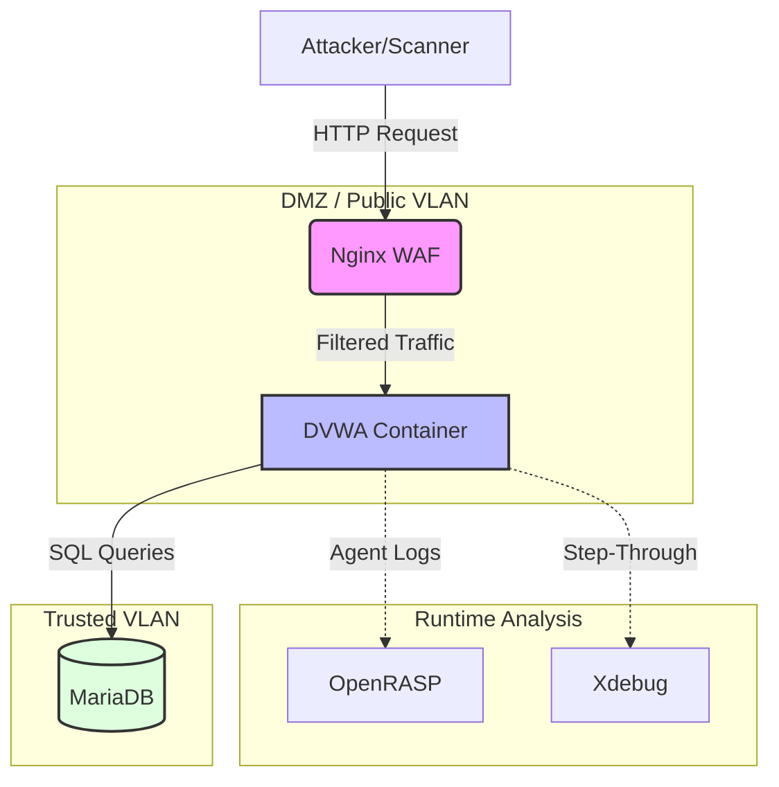

# Automated "Grey Box" DevSecOps Laboratory

  

## 1. Executive Summary
This project transforms the "Damn Vulnerable Web App" (DVWA) into a hardened, enterprise-grade environment. Unlike standard pipelines that simply scan code, this project utilizes **"Grey Box" methodology**: baking security agents (OpenRASP) and debugging tools (Xdebug) directly into the build artifact to correlate external attacks with internal code execution.

**Objective:** To simulate a high-maturity Secure SDLC by orchestrating three core domains: Security Engineering, DevSecOps, and Advanced AppSec Research.

---

## 2. Lab Architecture & Workflow
The pipeline enforces a "Zero Trust" runtime environment and automates vulnerability reporting to centralized systems of record.

## 3. Project Domains
Click the links below for deep-dives into the implementation details of each domain.

| Domain | Focus Area | Key Technologies |
| :--- | :--- | :--- |
| [**Security Engineering**](docs/security-engineering.md) | Network Segmentation & WAF | Docker Networks, Nginx, ModSecurity |
| [**DevSecOps**](docs/devsecops.md) | CI/CD Automation & Orchestration | GitLab CI, DefectDojo, Trivy, Semgrep |
| [**AppSec & Vuln Mgmt**](docs/appsec-research.md) | Exploit Analysis & Remediation | Xdebug, OpenRASP, OWASP ZAP |

---

## 4. Key Differentiators
* **Grey Box Instrumentation:** The build artifact includes baked-in security agents (OpenRASP) and debugging tools (Xdebug) that are disabled by default but can be toggled for advanced "Lab Mode" testing.
* **Multi-Destination Reporting:** Vulnerabilities are intelligently routed:
    * **DefectDojo:** Aggregates findings from SAST, DAST, and Container scans.
    * **Dependency-Track:** Manages SBOM and License Risk.
    * **SonarQube:** Tracks Code Quality and Technical Debt.
* **Zero-Trust Networking:** The runtime environment enforces strict isolation between the Web Application, Database, and WAF.

---
*Created by [Your Name]*
