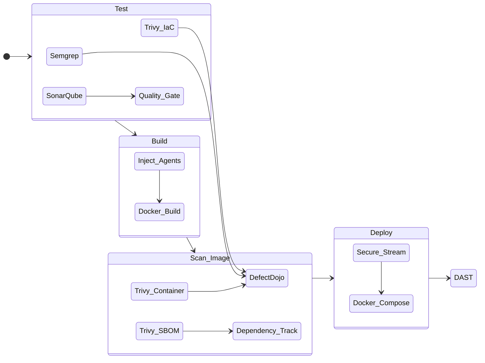
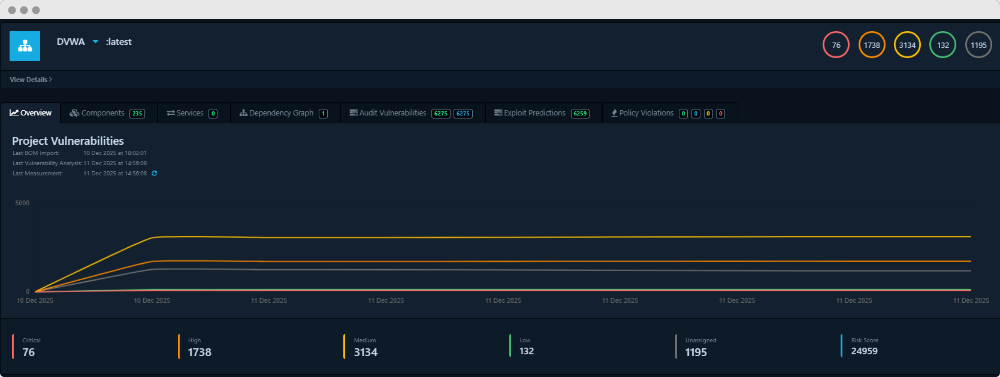

# DevSecOps: Pipeline & Orchestration

## 1. Domain Overview
The pipeline is the central nervous system of this project. It is designed not just to deploy code, but to enforce a **Secure SDLC** by integrating automated security gates directly into the developer workflow.

Running on **GitLab CI**, the pipeline orchestrates a "Shift Left" strategy, ensuring that code, infrastructure, and supply chain artifacts are scanned before they ever reach the runtime environment.

### Pipeline Visualization

📸 <strong>Click to collapse Pipeline View</strong>

*Figure 1: Full execution flow showing separate tracks for Infrastructure (IaC) and Application (SAST) scanning.*

---

## 2. Pipeline Stages & Gates

### Stage 1: Test (Source & Infrastructure)
This stage enforces **Segregation of Duties** by splitting scans into two distinct tracks:
* **Application Logic:** **Semgrep** scans PHP source code for high-confidence vulnerability patterns (SQLi, Command Injection).
* **Infrastructure as Code:** **Trivy Config** scans `utilities/` (including Dockerfiles) for misconfigurations (e.g., exposed ports, running as root).
* **Code Quality:** **SonarQube** analyzes the codebase for "Code Smells" and technical debt.

📸 <strong>View SonarQube Quality Gate</strong>

*Tracks Technical Debt, Code Smells, and Duplication ratios.*

### Stage 2: Build (Context-Aware)
* **Mechanism:** Constructs the "Grey Box" artifact using a context-aware Docker build (Root context + Utilities Dockerfile).
* **Security Injection:** The build process injects **Xdebug** and **OpenRASP** agents into the container but leaves them in a "disabled/monitoring" state by default to minimize performance impact.

### Stage 3: Scan Image (Supply Chain)
* **SBOM Generation:** **Trivy** generates a CycloneDX Software Bill of Materials (SBOM) and uploads it to **Dependency-Track**.
* **Container Scan:** Checks the final built binary for OS-level CVEs (e.g., Debian vulnerabilities).

📸 <strong>View Dependency-Track SBOM Analysis</strong>

*Monitors third-party libraries for license risk and outdated versions.*

### Stage 4: Deploy (Secure Transport)
* **Mechanism:** Deploys to the DMZ using **SSH Streaming** (`docker save | ssh load`), bypassing the need for a public registry.

### Stage 5: DAST (Dynamic Analysis)
* **Tool:** **OWASP ZAP** (Automation Framework) via a custom Python controller.
* **Action:** Executes an aggressive spider and active scan against the running application to validate findings from the outside in.

---

## 3. Automation Logic: The "Glue" Middleware
To solve the problem of disjointed reporting tools, I developed a custom Python middleware library that acts as the orchestration layer for **DefectDojo**.

**Key Capabilities:**
* **Smart Product Management:** Automatically creates Products and Engagements in DefectDojo if they don't exist, utilizing metadata from the pipeline.
* **Intelligent Deduplication:** It handles the engagement logic to ensure findings are tracked correctly over time rather than creating duplicate reports for every pipeline run.
* **Environment Adaptation:** The script pulls configuration directly from environment variables (e.g., `ZAP_TARGET`, `DOJO_URL`), enabling dynamic scans across different branches.

📸 <strong>View DefectDojo Aggregation</strong>

*Centralized dashboard showing aggregated criticalities from ZAP, Trivy, and Semgrep.*

---

## 4. Configuration Highlights
* **Secrets Management:** No hardcoded credentials. All API keys (SonarQube, DefectDojo, SSH Keys) are managed via GitLab CI/CD Variables (Mapped to [**NIST IA-2**](https://csrc.nist.gov/Projects/risk-management/sp800-53-controls/release-search#!/control?version=5.1&number=IA-2)).
* **SCA Sanitization:** SBOMs are sanitized using `jq` to strip known license noise before ingestion into Dependency-Track, ensuring high-fidelity reporting.

---

## 5. Key Artifacts
*See the `reports/devsecops` directory for raw data.*

| Artifact | Description | Compliance Mapping |
| :--- | :--- | :--- |
| **[.gitlab-ci.yml](../dvwa_pipeline.yml)** | Full Pipeline Configuration. | **NIST SA-11** (Developer Testing) |
| **[Semgrep Report](../reports/semgrep-app.json)** | SAST findings for PHP Source. | **NIST RA-5** (Static Analysis) |
| **[CycloneDX SBOM](../reports/sbom_clean.json)** | Software Bill of Materials. | **NIST SR-3** (Supply Chain) |

---

*Return to [Main Project README](../README.md)*
    state DAST {
        ZAP_Scan --> DefectDojo
    }
