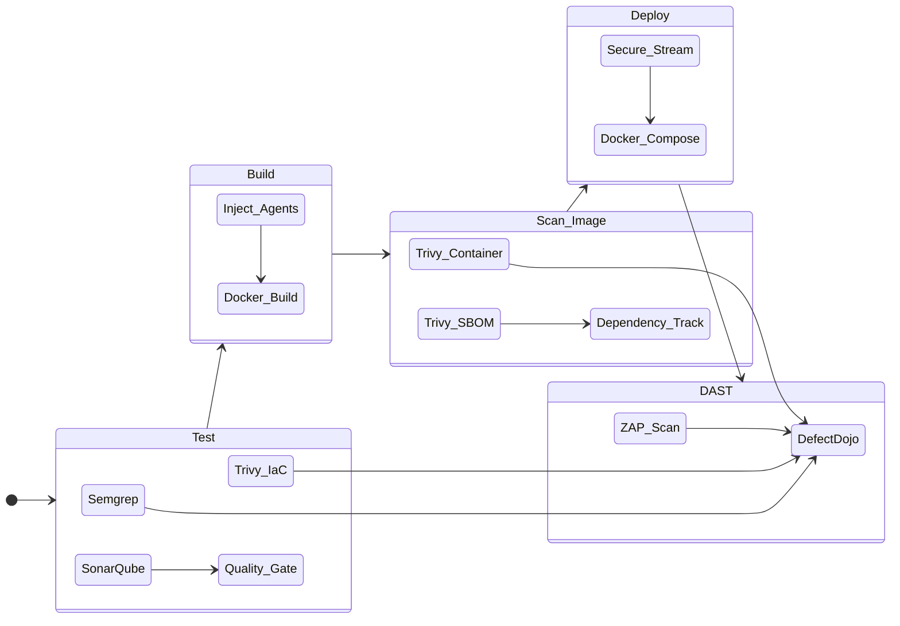

# DevSecOps: Pipeline & Orchestration

## 1. The CI/CD Pipeline
The pipeline is designed to save time while enforcing security gates. It runs on GitLab CI and integrates multiple scanners into a unified workflow.

## 2. Pipeline Stages
1.  **Stage 1: Test (Source & Infrastructure):**
    * **Semgrep:** Scans PHP source code for SQLi/Command Injection patterns.
    * **Trivy (IaC):** Scans `Dockerfile` and `docker-compose.yml` for misconfigurations (e.g., exposed ports).
    * **SonarQube:** Checks for code smells and technical debt.
2.  **Stage 2: Build:**
    * Constructs the "Grey Box" artifact with Xdebug and OpenRASP disabled by default.
3.  **Stage 3: Scan Image (Supply Chain):**
    * **Trivy:** Generates an SBOM (CycloneDX) and pushes it to **Dependency-Track**.
    * **Container Scan:** Checks the built binary for OS-level CVEs.
4.  **Stage 4: Deploy:**
    * Deploys to the DMZ using SSH streaming.
5.  **Stage 5: DAST:**
    * **OWASP ZAP:** Runs an aggressive spider and active scan against the running application.

## 3. Automation Logic: `dojo_ci.py`
To solve the problem of disjointed reporting, I developed a custom Python middleware library (`dojo_ci.py`) that acts as the "glue" for DefectDojo.

**Key Features:**
* **Smart Product Management:** Automatically creates Products and Engagements if they don't exist based on metadata in `dojo_config.yml`.
* **Deduplication Logic:** It identifies the specific Test ID associated with a tool. If a vulnerability found in Build #1 is missing in Build #2, the script hits the `/api/v2/reimport-scan/` endpoint to automatically mark it as **Mitigated**.
* **Branch Awareness:** Dynamically names engagements `DVWA - [Branch Name]` to keep `main` branch data clean.

## 4. Configuration Highlights
* **No Hardcoded Secrets:** All API keys (SonarQube, DefectDojo) are managed via GitLab CI/CD Variables.
* **SCA Management:** SBOMs are sanitized using `jq` to strip known license noise before ingestion into Dependency-Track.
