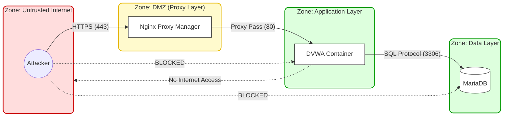

# Security Engineering: Architecture & Defense

## 1. Domain Overview

In this domain, I simulate the challenge of securing a legacy, vulnerable application by wrapping it in a modern, segmented network architecture.

The goal is not to patch the application code immediately, but to design an infrastructure that limits the blast radius of a successful compromise. This involves moving from a flat network topology to a Zero-Trust segmentation model, ensuring that a compromise of the web server does not guarantee access to the database or the host filesystem.

### GRC Alignment: Managing Technical Debt
This architecture simulates a realistic Risk Management workflow found in mature enterprises. Often, immediate code remediation is not feasible due to competing development priorities.
* **Compensating Controls:** By implementing strict segmentation and a WAF, I reduce the likelihood of exploitation, effectively lowering the residual risk.
* **POAM Workflow:** This defensible posture allows me to utilize **DefectDojo** to place vulnerabilities on a Plan of Action and Milestones (POAM). I can assign future remediation dates based on risk criticality rather than blocking deployment, mirroring real-world Operational Necessity waivers.

---

## 2. Network Segmentation Strategy

I implemented a strict network isolation strategy using Docker Compose networks to create three distinct zones. This prevents lateral movement and enforces a "deny-by-default" traffic policy (Mapped to [**NIST SC-7: Boundary Protection**](https://csrc.nist.gov/Projects/risk-management/sp800-53-controls/release-search#!/control?version=5.1&number=SC-7)).




### Segmentation Logic
* **The DMZ (Frontend):** The **Nginx Proxy Manager** is the only container with ports exposed to the host/internet (80/443). It acts as the gateway and TLS terminator.
* **The Application Layer (Middleware):** The DVWA container resides in an internal bridge network. It accepts traffic *only* from the Proxy Layer. Direct IP access is blocked.
* **The Trusted Layer (Backend):** The MariaDB container resides in a deeply isolated network (`db-net`). It accepts connections *only* from the Application Layer on port 3306. It has no route to the internet.

---

## 3. Defense Implementation

### 3.1 Perimeter Defense (Reverse Proxy)
Direct exposure of application servers is an anti-pattern. I utilize **Nginx Proxy Manager** to strictly control ingress traffic.
* **Attack Surface Reduction:** Hides the underlying application server identity (Apache/PHP headers) and blocks direct IP-based scanning.
* **SSL/TLS Termination:** Centralizes certificate management, ensuring encrypted transport even for legacy apps that don't natively support modern TLS versions.


### 3.2 Deployment Security (Secure Transport)
To prevent "Man-in-the-Middle" attacks, the pipeline utilizes a streamed push over SSH rather than pulling from a public registry.
* **Benefit:** The build artifact never touches an intermediate registry and is encrypted in transit via SSH, mitigating **Supply Chain Risk** (NIST SR-3).

```bash
# Pipes the local image directly to the remote daemon via SSH
docker save $LOCAL_IMAGE_NAME | ssh $TARGET_USER@$TARGET_IP "docker load"
```
[View full pipeline configuration](../dvwa_pipeline.yml)


### 3.3 Runtime Observability
While the container OS utilizes standard hardening (non-root users where possible), the primary engineering effort focused on **Observability**.
* **Instrumentation:** I injected **OpenRASP** (Runtime Application Self-Protection) directly into the PHP runtime.
* **Strategy:** Unlike a WAF which guesses based on patterns, this agent hooks into the PHP engine itself to detect malicious calls (e.g., `system()`, `mysqli_query()`) at the point of execution.
* **Config:** Currently set to `log` mode to facilitate "Grey Box" learning, creating a feedback loop between attacks and logs.

---

## 4. Key Artifacts & Reports
*See the `reports/security-engineering` directory for raw data.*

| Artifact | Description | Compliance Mapping |
| :--- | :--- | :--- |
| **[Network Topology](../architecture/network-diagram.png)** | Visual validation of the Docker network bridges. | [**NIST SC-7** (Boundary Protection)](https://csrc.nist.gov/Projects/risk-management/sp800-53-controls/release-search#!/control?version=5.1&number=SC-7) |
| **[Nmap Scan](../reports/nmap-external.txt)** | Validates that only ports 80/443 are visible from the outside. | [**NIST RA-5** (Vuln Monitoring)](https://csrc.nist.gov/Projects/risk-management/sp800-53-controls/release-search#!/control?version=5.1&number=RA-5) |
| **[OpenRASP Config](../utilities/openrasp.yml)** | The customized agent configuration policy. | [**NIST SI-4** (System Monitoring)](https://csrc.nist.gov/Projects/risk-management/sp800-53-controls/release-search#!/control?version=5.1&number=SI-4) |

---

*Return to [Project Home](../README.md)*
